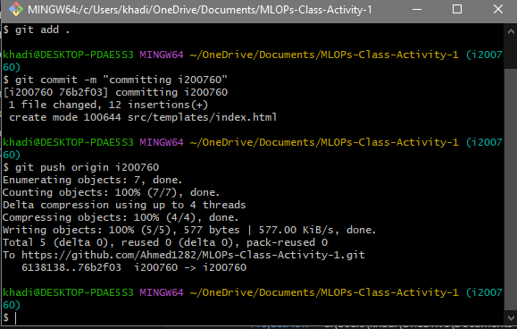
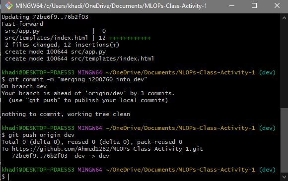

# MLOPs-Class-Activity-1_i200760_i201884

### Git Commands

1. First we initialized and created a github  repository with both team members as collabrators
```bash
git init
git remote add origin [<repository_url>](https://github.com/Ahmed1282/MLOPs-Class-Activity-1.git)https://github.com/Ahmed1282/mlop_class_task_1_i201884_and_i200760.git
```
2. Then we created two more branches i.e., dev and test in addition to the main branch. We created two additional branches for the two team members from the dev branch.
```bash

git checkout -b dev
git checkout -b test
git checkout -b i200760
git checkout -b i201884
```

3. Both the team members staged and pushed the code in their respective branches.
```bash
git add .
git commit -m "Commit message"
git push origin i200760
```
4. Both team members merged their branches into the dev branch.
```bash
git checkout dev
git merge i200760
git commit -m "Merge <branch_name> into main"
git push origin main
```




